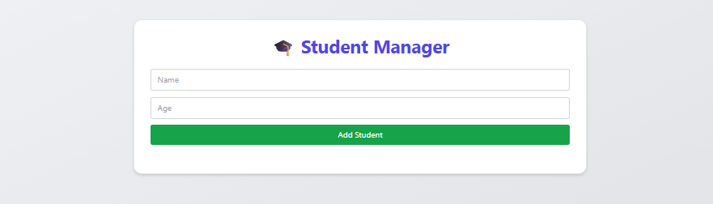
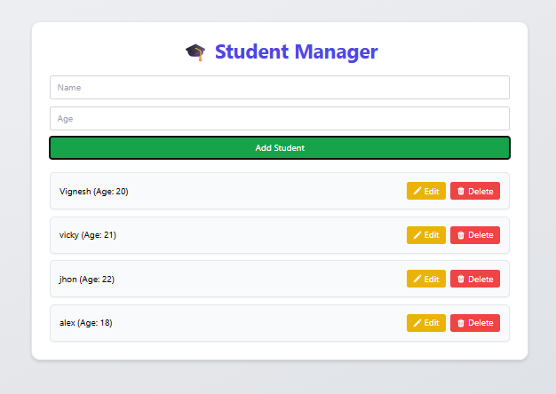
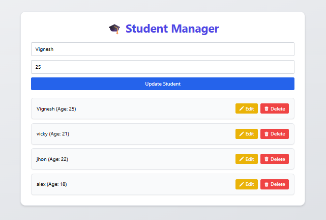

# 🎓 Student Manager – Full Stack Web App

A complete Full Stack Student Management System built with **React**, **Tailwind CSS**, and **Node.js (Express)**.  
This project allows users to **add**, **edit**, **delete**, and **view** students with clean UI and real-time feedback using **toast notifications**.

---

## 🚀 Features

- ✅ Add a student with name and age
- ✅ Edit existing student records
- ✅ Delete student entries
- ✅ Form validations (empty name or invalid age)
- ✅ Toast notifications for actions
- ✅ Heroicons for action buttons
- ✅ Animations and transitions
- ✅ Fully responsive + Tailwind styled
- ✅ Clean code, minimal setup

---

## 🔧 Tech Stack

| Frontend           | Backend         |
|--------------------|-----------------|
| React.js           | Node.js         |
| Tailwind CSS       | Express.js      |
| Heroicons          | CORS            |
| Axios              | REST API        |
| React Toastify     | In-Memory DB    |

---

## 📷 Screenshots

📁 Project Structure

student-manager-app/
├── backend/          → Express server (server.js)
├── frontend/         → React + Tailwind frontend
├── package.json
└── README.md
📦 Installation & Setup
🖥️ Frontend

cd student-manager-app
npm install
npm start
⚙️ Backend

cd backend
npm install
node server.js
The React app runs on http://localhost:3000
The backend API runs on http://localhost:4000

🔗 API Endpoints
Method	Endpoint	Description
GET	/students	Get all students
POST	/students	Add a new student
PUT	/students/:id	Update student by ID
DELETE	/students/:id	Delete student by ID

🧠 Author
Vignesh Pobbathi
B.Tech - CSE (Data Science)
💼 Passionate about Full Stack Development, ML,Data Analysis and solving real-world problems.
